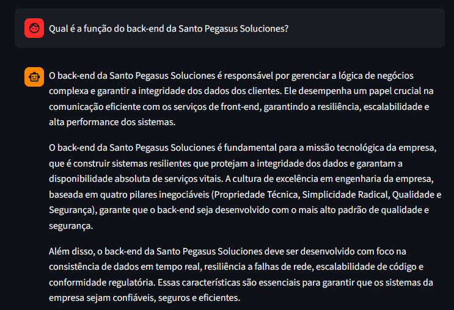
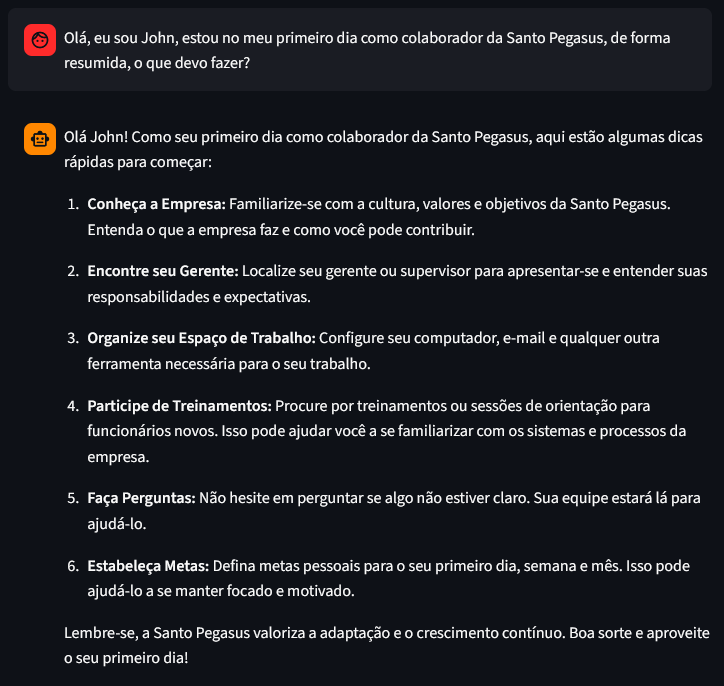
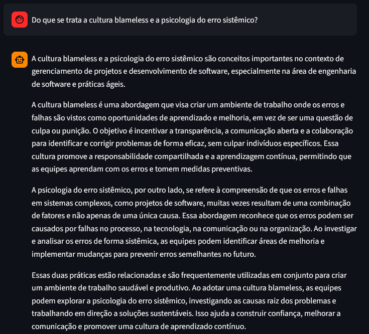

# Santo Pegasus Agent

## Descrição geral

O **Santo Pegasus Agent** é um assistente de inteligência artificial desenvolvido para a empresa ficticia "Santo Pegasus Soluciones". O projeto utiliza documentos internos em formato PDF como fonte de conhecimento para que o agente possa responder perguntas relacionadas às informações presentes nesses documentos.

Para isso, foi implementada uma arquitetura baseada em **Retrieval-Augmented Generation (RAG)**. Os documentos são processados, transformados em embeddings e armazenados em um banco de dados vetorial. Quando o usuário realiza uma pergunta, o sistema busca os trechos mais relevantes dos documentos e os utiliza como contexto para que o modelo de linguagem possa gerar uma resposta fundamentada nas informações disponíveis.

O projeto foi desenvolvido em **Python** e utiliza ferramentas do ecossistema LangChain, além de serviços de embeddings e armazenamento vetorial.

---

## Arquitetura da solução

A solução implementada segue uma arquitetura RAG composta pelas seguintes etapas:

```text
                         ┌─────────────────────┐
                         │   Documentos PDF    │
                         └──────────┬──────────┘
                                    │
                                    ▼
                         ┌─────────────────────┐
                         │    PDF Inspector    │
                         │ Extração do conteúdo│
                         └──────────┬──────────┘
                                    │
                                    ▼
                         ┌─────────────────────┐
                         │   Pré-processamento │
                         │ e divisão em chunks │
                         └──────────┬──────────┘
                                    │
                                    ▼
                         ┌─────────────────────┐
                         │   Cohere Embeddings │
                         │ Vetorização do texto│
                         └──────────┬──────────┘
                                    │
                                    ▼
                         ┌─────────────────────┐
                         │       ChromaDB      │
                         │    Banco vetorial   │
                         └──────────┬──────────┘
                                    │
                                    │
                                    │
                         ┌──────────▼──────────┐
                         │     Pergunta do     │
                         │       usuário       │
                         └──────────┬──────────┘
                                    │
                                    ▼
                         ┌──────────────────────┐
                         │      Retriever       │
                         │Busca por similaridade│
                         └──────────┬───────────┘
                                    │
                                    ▼
                         ┌─────────────────────┐
                         │ Contexto relevante  │
                         │   dos documentos    │
                         └──────────┬──────────┘
                                    │
                                    ▼
                         ┌─────────────────────┐
                         │     Agente de IA    │
                         │      LangChain      │
                         └──────────┬──────────┘
                                    │
                                    ▼
                         ┌─────────────────────┐
                         │ Resposta ao usuário │
                         └─────────────────────┘
```

### Fluxo de ingestão

Inicialmente, os documentos PDF são processados pelo **pdf-inspector**, responsável pela extração das informações presentes nos arquivos.

O conteúdo extraído é posteriormente processado e dividido em partes menores (*chunks*). Essa divisão facilita a recuperação de informações específicas durante as consultas.

Cada trecho de texto é então convertido em uma representação vetorial utilizando os **embeddings da Cohere**. Os vetores gerados são armazenados no **ChromaDB**, permitindo que posteriormente sejam realizadas buscas por similaridade semântica.

### Fluxo de consulta

Quando o usuário envia uma pergunta, o sistema utiliza o mecanismo de recuperação do LangChain para realizar uma busca no ChromaDB.

Os trechos dos documentos mais relevantes para a pergunta são recuperados e enviados como contexto para o agente de IA. Dessa forma, o modelo pode formular sua resposta utilizando as informações presentes nos documentos fornecidos pela empresa, reduzindo a necessidade de depender exclusivamente do conhecimento previamente adquirido pelo modelo.

---

## Tecnologias e ferramentas utilizadas

- **Python**: Linguagem de programação utilizada para o desenvolvimento de toda a aplicação.

- **LangChain**: Framework utilizado para estruturar o pipeline de RAG, incluindo o processamento dos documentos, criação dos embeddings, recuperação dos documentos relevantes e integração com o agente de IA.

- **Cohere**: Utilizada para geração de **embeddings**, transformando os trechos dos documentos em vetores que podem ser comparados semanticamente e também como LLM que responde o usuário.

- **ChromaDB**: Banco de dados vetorial utilizado para armazenar os embeddings dos documentos e realizar buscas por similaridade.

- **PDF Inspector**: Utilizado para auxiliar na análise e extração do conteúdo dos documentos PDF utilizados como base de conhecimento do sistema.

- **python-dotenv**: Biblioteca Python utilizada para carregar variáveis de ambiente a partir de um arquivo `.env`, permitindo manter informações sensíveis, como chaves de API, fora do código-fonte.

- **streamlit**: Framework Python usado para criar aplicações web interativas de maneira simples e rápida.

---

## Instruções para executar o projeto

### Requisitos:
- Python (versão 3.10.0 pelo menos)
- Uma chave api da Cohere;
- As tecnologias anteriormente citadas;

### Instalação
1. Clonar este repositório: 
```bash
git clone https://github.com/gabriruf/Santo-Pegasus-Agent.git
```

2. Criar o seu .env e alterar os valores padrão:
```bash
cp .env.example .env
```

```ini
COHERE_API_KEY="your-cohere-api-key"
EMBEDDING_MODEL="cohere-embedding-model" # e.g. embed-multilingual-v3.0
CHAT_MODEL="cohere-chat-model" # e.g. command-r7b-12-2024COHERE_API_KEY=""
```

3. Criar um ambiente virtual Python:
```bash
python -m venv .venv
```

4. Instalar as bibliotecas Python:
```bash
pip install -Uq python-dotenv langchain langchain-text-splitters langchain-cohere langchain-chroma pdf-inspector langchain-pdf-inspector streamlit
```

5. Executar o arquivo `src/rag/vector_db` para gerar o banco de dados vetorial:
```bash
python ./src/rag/vector_db.py
```

6. Inicializar a instância local do Streamlit:
```bash
streamlit run main.py
```

> *Dessa forma, o servidor irá abrir na porta*: <http://localhost:8501>

---

## Exemplos de perguntas que o agente NÃO consegue responder

1. 
Usuário: Quem ganhou a copa do mundo FIFA de 1958?
> Resposta: Não tenho informações suficientes para responder a essa pergunta.

2.
Usuário: Quem é o atual presidente dos Estados Unidos da América?
> Resposta: Não tenho acesso a informações atualizadas em tempo real, então não sei responder com precisão quem é o atual presidente dos Estados Unidos da América. Para obter essa informação, recomendo consultar fontes confiáveis de notícias ou sites governamentais.

---

## Exemplos de respostas geradas pelo agente
1. 


2. 


3. 
